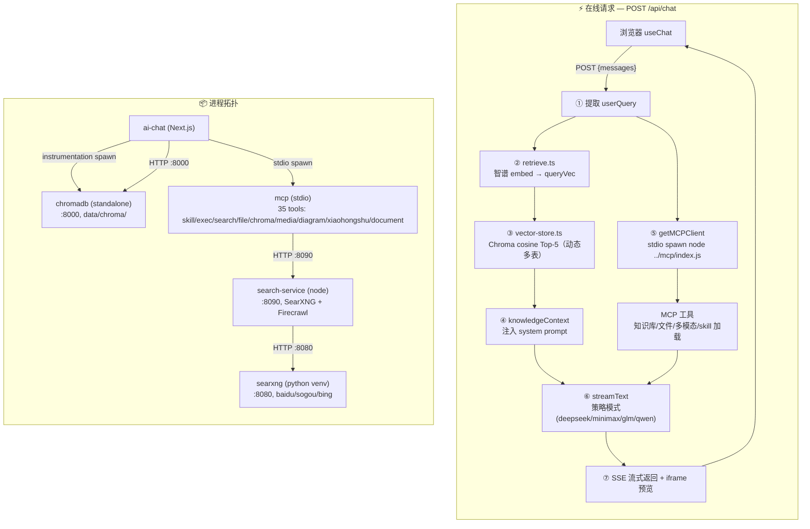

# 小盛开AI 设计文档

> 本文档记录**设计决策、规范与约定**。代码怎么组织（目录结构、模块职责、子系统实现）见 `ARCHITECTURE.md`，版本变更历史见 `CHANGELOG.md`。

## UI 风格

**Neo-Brutalism 糖果色** — 后续所有 UI 开发均遵循此风格，组件库使用 shadcn/ui。多主题可切换（`data-theme` 作用域覆盖 token）。

### 视觉规范

| 元素 | 规范 |
|------|------|
| 背景 | 纯白 `#FFFFFF`，次背景 `--muted #F5F5F5` |
| 边框 | 2-4px 纯黑实线 + 零模糊纯黑硬阴影（`Npx Npx 0 #000`） |
| 主色 | 电光黄 `#FFE135`（黑字），粉/蓝/紫/橙/深绿点缀 |
| 气泡 | 用户黑底白字 + 黄硬阴影（`bg-ink`）、AI 白底黑字（`bg-card`） |
| 头像 | AI 黄底黑字、ME 粉底白字，2px 黑边 |
| 按钮 | 黑边硬阴影，hover 位移 + 阴影扩大，active 按压 |
| 圆角 | 直角（`--radius: 0`） |
| 字体 | Inter（正文）/ Plus Jakarta Sans（标题）/ JetBrains Mono（标签） |
| 加载 | 黄色旋转环 + 滑块进度条 |
| 禁用 | 渐变 / 模糊 / 毛玻璃 / 荧光亮绿 |

### 组件规则

- 基础组件用 shadcn/ui（Button、Input 等），不手写
- 主题样式通过 CSS 变量 + `data-theme` 作用域，经 `@theme inline` 映射成 Tailwind 类
- 所有 token 定义在 `globals.css` 的 `[data-theme="*"]` 块，无额外依赖

## 架构流程



## 环境与外部依赖

### 运行时

| 依赖 | 要求 | 验证 |
|---|---|---|
| Node.js | ≥ 20 | `node --version` |
| Python | ≥ 3.10(仅 Chroma 需要) | `python3 --version` |
| uv | latest(安装 Chroma 用) | `uv --version` |

### 外部 API

| 服务 | URL | 用途 |
|---|---|---|
| 智谱 AI | `https://open.bigmodel.cn/api/paas/v4` | Embedding(`embedding-3`) |
| DeepSeek V4 Pro | `https://api.deepseek.com/v1` | 对话生成 |
| MiniMax | `https://api.minimaxi.com/v1` | 图片生成、图片理解、TTS/BGM |
| MiniMax-M3 | `https://api.minimaxi.com/v1/chat/completions` | 对话/图片理解（OpenAI 兼容） |
| 阿里 Qwen | `https://dashscope.aliyuncs.com/compatible-mode/v1` | 对话（qwen3.8-max，已接入，额度待配置） |
| Firecrawl Cloud | `https://api.firecrawl.dev` | 网页正文抓取（scrape/map/crawl/parse，key 在 `.env`） |

### 本地依赖

| 路径 | 是否必须 | 用途 |
|---|---|---|
| `data/chroma/` | 运行时持久化 | Chroma 数据 |
| `packages/mcp/` | 必选 | MCP 服务器集合 |

### 工作流数据存储

执行记录与资产库分离（v0.11.8 起）：

| 路径 | 内容 |
|---|---|
| `data/workflows/tasks/<executionId>/` | 工作流执行记录（state.json + 产物） |
| `data/workflows/assets/characters/` | 角色参考图（图片 + 元信息，跨执行复用） |
| `data/workflows/assets/styles/` | 风格（纯文本，跨执行复用） |

决策：资产（参考图/风格）是跨执行持久数据，不能与执行记录混放（`listExecutions` 扫描目录会误判）；故执行记录下沉 `tasks/`、资产独立 `assets/`，统一收拢在 `data/workflows/` 命名空间下。资产库定位为**工作流级通用**（非某模板专属），comic 模板通过 `characterRef`/`styleId` 参数引用。

## API 约定

### POST /api/chat

**请求体**
```json
{
  "messages": [
    {
      "id": "msg_1",
      "role": "user",
      "parts": [{ "type": "text", "text": "记住 Java Stream 是惰性求值" }]
    }
  ]
}
```

**响应** — SSE 流式返回，由 `@ai-sdk/react` 的 `useChat` 自动解析。

**处理流程**
1. 提取最后一条用户消息
2. 智谱 `embedding-3` 生成查询向量
3. Chroma cosine 检索 Top-5 知识片段（动态多表：shared + chat 全部 collection）
4. 注入 `knowledgeContext` + `SKILL_LIST` 到 system prompt
5. 启动/复用 1 个 MCP client（stdio spawn `node ../mcp/index.js`，33 tools）
6. `streamText` 按策略模式路由（deepseek / minimax / glm / qwen，DeepSeek 经 classifyTask 分 pro/flash）
7. SSE 流式返回，图表/视频通过 iframe 预览

## 环境变量

API Key 统一在项目根目录 `.env` 配置：

```bash
DEEPSEEK_API_KEY=sk-xxx
DEEPSEEK_BASE_URL=https://api.deepseek.com/v1
DEEPSEEK_PRO_MODEL=deepseek-v4-pro
DEEPSEEK_FLASH_MODEL=deepseek-v4-flash
GLM_API_KEY=xxx
GLM_BASE_URL=https://open.bigmodel.cn/api/paas/v4
GLM_EMBEDDING_MODEL=embedding-3
MINIMAX_API_KEY=xxx
MINIMAX_BASE_URL=https://api.minimaxi.com/v1
MINIMAX_IMAGE_MODEL=image-01
MINIMAX_CHAT_MODEL=MiniMax-M3
QWEN_API_KEY=xxx
QWEN_BASE_URL=https://dashscope.aliyuncs.com/compatible-mode/v1
QWEN_CHAT_MODEL=qwen3.8-max

# Chroma 多库名（默认值，可不配）
CHROMA_SHARED_DB=shared
CHROMA_CHAT_DB=chat
CHROMA_CODE_DB=code
```

`CHROMA_URL` 从 `config/network.json` 读（hosts.local + ports.chroma），`CHROMA_AUTO_START` 默认开启、无需配置。

## 网络配置

端口 / host 单一真相源，集中在 `config/network.json`（详见 config/README.md）。

```jsonc
{
  "hosts": {
    "local": "localhost",                 // 本机地址
    "public": "node.tailddce43.ts.net"   // 公网域名（tailscale funnel）
  },
  "ports": {
    "aiChat": { "dev": 3000, "prodDirect": 4567, "prodProxy": 4321 },
    "chroma": 8000
  }
}
```

读取方式（三类消费者）：

| 消费者类型 | 方式 | 示例 |
|---|---|---|
| CJS | `require('../config/network.json')` | `proxy.cjs` |
| bash | `node -e "require('./config/network.json').X"` | `prod.sh` / `dev.sh` / `stop.sh` |
| ESM | `loadNetworkConfig()` | mcp 各模块、ai-chat 服务端 / scripts |

`loadNetworkConfig()` 定义在 `packages/shared/network.js`：从 `process.cwd()` 向上遍历找 `config/network.json`（最多 5 层），找到返回解析对象，找不到抛错（带 cwd 信息），调用方无需关心 cwd/项目根在哪。

明确不在 config 里：API key、LLM endpoint、`BASE_PATH`、Chroma DB 名。

## 日志规范

### 统一约定

所有日志统一三条规则：**倒序（新日志在前，prepend 写入）**、**按日轮转（`xxx-YYYY-MM-DD.log`）**、**保留 7 天自动清理**。由 `packages/shared/logger.js` 的 `createLogger` / `createDateLogger` 实现。

> 注意：倒序与 `tail -f` 不兼容（新日志写文件顶部，`tail -f` 盯底部会吐旧行）。看实时日志用 `cat` / 编辑器，勿依赖 `tail -f`。

### 日志目录

| 目录 | 文件 | 写者 |
|---|---|---|
| `logs/app/` | `app-YYYY-MM-DD.log` | ai-chat（instrumentation）+ MCP |
| `logs/tasks/` | `tasks-YYYY-MM-DD.log` | scheduler + 手动触发（run-task.js） |
| `logs/tasks/` | `<task-name>.log` | HTTP「立即执行」（handlers） |
| `logs/services/` | `services-YYYY-MM-DD.log` | search-service + searxng（经 log-wrap） |
| `logs/workflows/` | `workflows-YYYY-MM-DD.log` | 工作流引擎 |

### 子服务日志（log-wrap）

search-service / searxng 是独立进程，不 import 共享 logger。统一用 `scripts/log-wrap.js <item> -- <cmd>` 包装启动：spawn 子进程、逐行把 stdout→`LOG` / stderr→`ERR` 写进 `services-YYYY-MM-DD.log`，子进程退出即退出、SIGTERM 转发。dev.sh / prod.sh 里 SearXNG 与搜索服务都走它。

### 踩坑备忘

- `createDateLogger` 只返回 logger 方法、**不自动包装 `console.log`**，需手动包（scheduler / run-task.js / log-wrap 都手动包）。
- searxng 禁用默认引擎要用 **`inactive: true`** 而非 `disabled: true`——`load_engines()` 只跳过 `inactive`，`disabled` 引擎照样 import + init 产生报错噪音；`disabled` 仅在搜索阶段过滤引擎。

## 图片生成经验

### OSS 签名 URL 规则

MiniMax 返回的图片链接包含三个绑定校验的参数：

| 参数 | 说明 |
|------|------|
| `Expires` | OSS 签名的过期时间（Unix 时间戳） |
| `OSSAccessKeyId` | 访问密钥 ID |
| `Signature` | 基于 Expires 等参数计算出的签名 |

**关键原则：URL 中任何一个字符都不能修改，必须原样透传。** 修改任意参数（如 Expires）会导致签名不匹配，OSS 返回 `SignatureDoesNotMatch`。

### 防护措施

- system prompt 已明确规则：URL 必须原样输出，不得修改
- `generateImage` 工具描述已强调"必须原样使用不得修改任何字符"
- 遇到 `SignatureDoesNotMatch` 错误，重新生成比尝试修复链接更高效

### 火山引擎 Seedream 图片模型

- 新增 provider `volcengine`（Doubao Seedream 5.0 lite），仅图片生成（`IMAGE_GENERATORS`）。
- 密钥/baseURL/model 放 `.env`（`VOLCENGINE_*`），`env.ts`+`init.ts` 注册，启动时 `initSettings` 种子进 `data/settings/providers.json`（真源仍为 providers.json，env 兜底）。
- baseURL 用 `/api/plan/v3`（plan key 端点），文档示例为 `/api/v3`，可在设置页改。

### 漫画文字渲染决策（AI 画气泡，非程序叠加）

- 生图模型画中文易乱码、气泡归属易错；曾尝试「图文分离 + puppeteer 程序化气泡叠加」（中文无乱码、归属正确），但叠加气泡与画面脱节、观感差，**已回退**。
- 最终决策：气泡框+中文仍由生图模型直接画，靠提示词减轻问题：对白≤3 短句（数组）、单句正文≤12 字硬校验、气泡内标注说话人名字、cast 左右位置提示、每说话人单气泡尾部指向该人物、画面干净无黑点。**接受少量错字**为模型固有代价（程序化叠字/填字两版均因视觉割裂被用户否决，不再尝试）。
- 微调（tweak）为**指定单页**：两种模式——「AI 微调」（底图=当前页编辑语义，只提交本次反馈）与「直接替换图片」（上传/粘贴 1 张图直接覆盖该页，不调 AI；替换递增 `tweakCount` 复用 `?v=` 缓存破坏刷新）。

### 漫画场景连续性决策（sceneId + 场景锚点）

- 问题：逐页独立生图导致同一连续对话每页场景重设计（背景/道具/机位漂移）。
- 决策：分镜每页输出 `sceneId`+`scenePrompt`（同 id 逐字一致的固定场景描述），`validateStoryboard` 硬校验；生图 prompt 带场景ID+固定描述；同一 `sceneId` 第一页生成后作**场景锚点**，后续页优先以锚点图作参考图（角色参考图兜底）。
- 人工修正窗口：分镜完成、生图未开始（generate-pages pending）时，执行详情页展示场景分组面板（中文场景名），可「并入上一场景」/「从此页新场景」；生图后不再展示（改了也不影响已生成图）。
- 取舍：锚点逐页串联（page i 参考 page i-1）会传播坏页错误，故用「场景首图锚点」而非逐页链；锚点假设 provider 跟参考图（Seedream 验证可用，minimax image-01 不跟参考图且偶发空白，不适用）。

## 已知问题

| # | 问题 | 影响 | 解决方案 |
|---|---|---|---|
| 1 | Chroma Python 包需 `uv tool install` | 一次性配置 | 已在快速开始文档化 |
| 2 | Chroma v3 where 不支持 `$exists` | 软删改用 `deleted` 字段 + `$ne: true` | 已处理 |
| 3 | Chroma 启动需 Python 进程 | 多了 ~50MB 内存 | standalone server 比 embedded 更稳 |
| 4 | `next/font/google` 构建时下载字体被墙 | 国内构建超时 | 改用本地 `@fontsource` 字体，移除 `Geist` 导入 |
| 5 | `getOrCreateCollection` 误创建大量空 collection | 管理面板有大量垃圾表 | 已清理，后续 `getCollectionSafe` 不自动创建 |

## 生产部署

```bash
npm run prod   # 构建 + 启动全部服务（AI 工作台 :4567 + 博客 :4321 + Tailscale Funnel）
npm run stop   # 停止全部服务 + 关闭内网穿透
npm run log    # 查看实时日志
```

服务端口：

| 服务 | 本地端口 | 公网地址 |
|------|---------|---------|
| AI 工作台 | 4567 | `https://node.tailddce43.ts.net:8443` |
| 博客 | 4321 | `https://node.tailddce43.ts.net` |
| ChromaDB | 8000 | 仅本地 |

端口 / host 集中在 `config/network.json`，改这里全局同步。

- 日志文件：见「日志规范」小节（`logs/{app,tasks,services,workflows}/` 按日轮转、倒序）
- 博客静态文件：`site/`，由 `proxy.cjs` 直接 serve
- Tailscale Funnel 提供内网穿透，无需公网 IP
