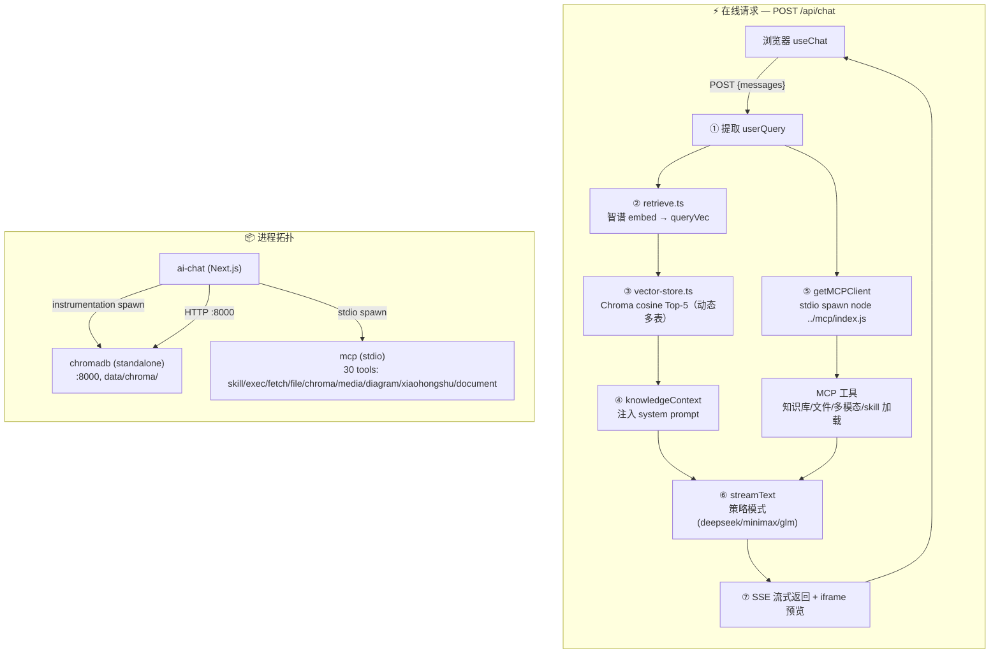

# 小盛开AI 设计文档

## UI 风格

**Neo-Brutalism 糖果色** — 后续所有 UI 开发均遵循此风格，组件库使用 shadcn/ui。多主题可切换（`data-theme` 作用域覆盖 token）。

### 视觉规范

| 元素 | 规范 |
|------|------|
| 背景 | 纯白 `#FFFFFF`，次背景 `--muted #F5F5F5` |
| 边框 | 2-4px 纯黑实线 + 零模糊纯黑硬阴影（`Npx Npx 0 #000`） |
| 主色 | 电光黄 `#FFE135`（黑字），粉/蓝/紫/橙/深绿点缀 |
| 气泡 | 用户黑底白字 + 黄硬阴影（`bg-ink`）、AI 白底黑字（`bg-card`） |
| 头像 | AI 黄底黑字、ME 粉底白字，2px 黑边 |
| 按钮 | 黑边硬阴影，hover 位移 + 阴影扩大，active 按压 |
| 圆角 | 直角（`--radius: 0`） |
| 字体 | Inter（正文）/ Plus Jakarta Sans（标题）/ JetBrains Mono（标签） |
| 加载 | 黄色旋转环 + 滑块进度条 |
| 禁用 | 渐变 / 模糊 / 毛玻璃 / 荧光亮绿 |

### 组件规则

- 基础组件用 shadcn/ui（Button、Input 等），不手写
- 主题样式通过 CSS 变量 + `data-theme` 作用域，经 `@theme inline` 映射成 Tailwind 类
- 所有 token 定义在 `globals.css` 的 `[data-theme="*"]` 块，无额外依赖

## 架构流程



## 环境与外部依赖

### 运行时

| 依赖 | 要求 | 验证 |
|---|---|---|
| Node.js | ≥ 20 | `node --version` |
| Python | ≥ 3.10(仅 Chroma 需要) | `python3 --version` |
| uv | latest(安装 Chroma 用) | `uv --version` |

### 外部 API

| 服务 | URL | 用途 |
|---|---|---|
| 智谱 AI | `https://open.bigmodel.cn/api/paas/v4` | Embedding(`embedding-3`) |
| DeepSeek V4 Pro | `https://api.deepseek.com/v1` | 对话生成 |
| MiniMax | `https://api.minimaxi.com/v1` | 图片生成、图片理解、TTS/BGM |
| MiniMax-M3 | `https://api.minimaxi.com/v1/chat/completions` | 图片理解（OpenAI 兼容） |

### 本地依赖

| 路径 | 是否必须 | 用途 |
|---|---|---|
| `data/chroma/` | 运行时持久化 | Chroma 数据 |
| `packages/mcp/` | 必选 | MCP 服务器集合 |

## API 约定

### POST /api/chat

**请求体**
```json
{
  "messages": [
    {
      "id": "msg_1",
      "role": "user",
      "parts": [{ "type": "text", "text": "记住 Java Stream 是惰性求值" }]
    }
  ]
}
```

**响应** — SSE 流式返回，由 `@ai-sdk/react` 的 `useChat` 自动解析。

**处理流程**
1. 提取最后一条用户消息
2. 智谱 `embedding-3` 生成查询向量
3. Chroma cosine 检索 Top-5 知识片段（动态多表：shared + chat 全部 collection）
4. 注入 `knowledgeContext` + `SKILL_LIST` 到 system prompt
5. 启动/复用 1 个 MCP client（stdio spawn `node ../mcp/index.js`，30 tools）
6. `streamText` 按策略模式路由（deepseek / minimax / glm，DeepSeek 经 classifyTask 分 pro/flash）
7. SSE 流式返回，图表/视频通过 iframe 预览

## 环境变量

API Key 统一在项目根目录 `.env` 配置：

```bash
DEEPSEEK_API_KEY=sk-xxx
DEEPSEEK_BASE_URL=https://api.deepseek.com/v1
DEEPSEEK_PRO_MODEL=deepseek-v4-pro
DEEPSEEK_FLASH_MODEL=deepseek-v4-flash
GLM_API_KEY=xxx
GLM_BASE_URL=https://open.bigmodel.cn/api/paas/v4
GLM_EMBEDDING_MODEL=embedding-3
MINIMAX_API_KEY=xxx
MINIMAX_BASE_URL=https://api.minimaxi.com/v1
MINIMAX_IMAGE_MODEL=image-01
MINIMAX_CHAT_MODEL=MiniMax-M3
MINIMAX_ANTHROPIC_BASE_URL=https://api.minimaxi.com/anthropic/v1

# Chroma 多库名（默认值，可不配）
CHROMA_SHARED_DB=shared
CHROMA_CHAT_DB=chat
CHROMA_CODE_DB=code
```

`CHROMA_URL` 从 `config/network.json` 读（hosts.local + ports.chroma），`CHROMA_AUTO_START` 默认开启、无需配置。

## 网络配置

端口 / host 单一真相源，集中在 `config/network.json`（详见 config/README.md）。

```jsonc
{
  "hosts": {
    "local": "localhost",                 // 本机地址
    "public": "node.tailddce43.ts.net"   // 公网域名（tailscale funnel）
  },
  "ports": {
    "aiChat": { "dev": 3000, "prodDirect": 4567, "prodProxy": 4321 },
    "chroma": 8000
  }
}
```

读取方式（三类消费者）：

| 消费者类型 | 方式 | 示例 |
|---|---|---|
| CJS | `require('../config/network.json')` | `proxy.cjs` |
| bash | `node -e "require('./config/network.json').X"` | `prod.sh` / `dev.sh` / `stop.sh` |
| ESM | `loadNetworkConfig()` | mcp 各模块、ai-chat 服务端 / scripts |

`loadNetworkConfig()` 定义在 `packages/shared/network.js`：从 `process.cwd()` 向上遍历找 `config/network.json`（最多 5 层），找到返回解析对象，找不到抛错（带 cwd 信息），调用方无需关心 cwd/项目根在哪。

明确不在 config 里：API key、LLM endpoint、`BASE_PATH`、Chroma DB 名。

## 图片生成经验

### OSS 签名 URL 规则

MiniMax 返回的图片链接包含三个绑定校验的参数：

| 参数 | 说明 |
|------|------|
| `Expires` | OSS 签名的过期时间（Unix 时间戳） |
| `OSSAccessKeyId` | 访问密钥 ID |
| `Signature` | 基于 Expires 等参数计算出的签名 |

**关键原则：URL 中任何一个字符都不能修改，必须原样透传。** 修改任意参数（如 Expires）会导致签名不匹配，OSS 返回 `SignatureDoesNotMatch`。

### 防护措施

- system prompt 已明确规则：URL 必须原样输出，不得修改
- `generateImage` 工具描述已强调"必须原样使用不得修改任何字符"
- 遇到 `SignatureDoesNotMatch` 错误，重新生成比尝试修复链接更高效

## 已知问题

| # | 问题 | 影响 | 解决方案 |
|---|---|---|---|
| 1 | Chroma Python 包需 `uv tool install` | 一次性配置 | 已在快速开始文档化 |
| 2 | Chroma v3 where 不支持 `$exists` | 软删改用 `deleted` 字段 + `$ne: true` | 已处理 |
| 3 | Chroma 启动需 Python 进程 | 多了 ~50MB 内存 | standalone server 比 embedded 更稳 |
| 4 | `next/font/google` 构建时下载字体被墙 | 国内构建超时 | 改用本地 `@fontsource` 字体，移除 `Geist` 导入 |
| 5 | `getOrCreateCollection` 误创建大量空 collection | 管理面板有大量垃圾表 | 已清理，后续 `getCollectionSafe` 不自动创建 |

## 知识库架构

### 多库多表

```
shared/  — 规则、偏好、个人信息
  └── base_knowledge

chat/    — 聊天产生的内容，按主题分 collection
  ├── chat_knowledge（默认）
  └── learn-<主题>（学习笔记，如 learn-finance）

code/    — 编码记忆，按项目名分 collection
  └── <项目名>（basename(process.cwd())）
```

### RAG 预检索

`retrieve.ts` 动态获取 shared + chat 所有 collection，不做硬编码。新增 `listCollections(database)` 函数（60s 缓存），未来任何新 collection 自动纳入检索。

### 工具使用

- `addKnowledge`: 主题笔记 → `database="chat" collection="<命名>"`，一般对话 → `database="chat"`（不传 collection）
- `searchKnowledge`: 默认搜 shared + chat/chat_knowledge，传 database 和 collection 时搜 shared + 指定库表
- `searchKnowledge` 每个 collection 取 `topK * 3`，合并后截断，避免跨 collection 遗漏

## SKILL 系统

### 设计理念

```
Skills = 知识（What）   ← 静态 SKILL.md 文件，描述"怎么做得好"
MCP    = 执行（How）    ← 工具函数，执行具体操作
```

### 架构

```
用户提问
  → route.ts 启动时扫描 packages/skills/ 目录，构建 SKILL_LIST
  → SKILL_LIST 注入 system prompt（<available_skills> 段，读 SKILL.md 的 frontmatter）
  → AI 根据用户需求判断是否需要加载 skill
  → AI 调用 loadSkill({ name }) 获取完整 SKILL.md 内容
  → AI 按 SKILL 指引执行
```

### 目录

```
packages/skills/
├── image-styles/                # 图片风格库（73 种风格）
│   ├── SKILL.md
│   └── styles/
├── blog/                        # 博客文章
│   └── SKILL.md
├── github-gem-seeker/           # GitHub 项目挖掘
│   └── SKILL.md
├── xiaohongshu-note/            # 小红书笔记
│   └── SKILL.md
└── task/                        # 定时任务
    └── SKILL.md
```

## 工作流系统

### 设计理念

模板驱动的工作流引擎：`template.json` 声明参数表单 + 步骤序列，引擎按步执行。与 AI Chat 解耦——通过独立 CLI 子进程 + stdout 纯 JSON 契约通信，前端只负责收集参数、驱动步骤、展示进度。

### 架构

```
/workflow 页面
  → POST /api/workflows/execute
  → ai-chat catch-all（app/api/workflows/[[...path]]）委托 @app/workflows/http
  → 通用 dispatcher（@app/shared/capability.js）按 actions.json 匹配动作
  → spawn node packages/workflows/cli.js start '{"template":..,"params":..}'
  → 返回 executionId
  → 逐步 spawn cli.js next（单步执行，每步返回 preview）
  → 执行状态持久化到 data/workflows/<executionId>/
  → 日志写到 logs/workflows/
```

**声明式能力注册（v0.11.0）**：ai-chat 对 workflows/tasks 只保留 1 个 catch-all 挂载点（10 行纯委托），能力 100% 在包内。动作由 actions.json 声明，4 原语：`cli`（spawn cli.js）/ `stream`（文件流 + Range）/ `upload`（formData 写盘）/ `custom`（包内 JS handler）。

- `workflows/actions.json`：引擎级 10 动作（templates/execute/executions/get/delete/file/next/auto/retry/skip）
- `templates/<name>/actions.json`：模板特有动作；video-generation 声明 generate-content/upload/tweak/switch-version
- `tasks/actions.json`：list/run/edit/dashboard（handler 在 tasks/lib/handlers.js）

CLI 子命令：`start`（创建执行）/ `run`（一次跑完）/ `next`（单步）/ `templates`（模板列表）/ `retry`（组合：重置+执行）/ `tweak-auto`（微调全流程编排）/ `switch-version`（按模板分发到 templates/<t>/lib/switch-version.js）。

**引擎与模板边界**：engine.js 是纯模板无关的步骤编排；脚本版本/微调等 video 概念在 templates/video-generation/lib/（tweak.js/switch-version.js/script-version.js）；模板不 import engine.js，cli 是子进程组合层。

### 步骤类型

| 类型 | 说明 |
|---|---|
| `ai` | AI 生成（LLM 调用） |
| `script` | 跑脚本 |
| `tool` | 调用模板内 `lib/` 的纯函数 |

### 模板

- `templates/tech-video/`：科技风短视频（script.json 驱动 + 逐场景 TTS + BGM + 硬字幕 + SRT）
- `templates/video-generation/`：视频生成

## 定时任务系统

### 设计理念

定时任务与 AI Chat 解耦：scheduler 是独立进程，任务代码是纯 Node.js 脚本，不依赖 Next.js。

### 架构

```
用户操作                        AI Chat 进程
  │                                │
  ├─ /schedule 页面               │
  │   ├─ 查看任务列表（GET /api/tasks）     │
  │   ├─ 立即执行（POST /api/tasks）       │
  │   └─ 仪表盘（GET /api/tasks/[name]/dashboard）│
  │                                │
  └─ 手动重启                       │
       │                           │
       ▼                           │
  scheduler 进程（常驻）            │
  ├─ 扫描 packages/tasks/*/task.json       │
  ├─ node-cron 注册每个 cron 表达式        │
  └─ 触发时 → import task → run() → 写日志 │
                                    │
  logs/tasks/<name>.log             │
  data/tasks/<name>.json            │
  data/tasks/<name>.lock            │
```

### 目录结构

```
packages/tasks/
├── package.json                   # @app/tasks workspace 包
├── scheduler.js                   # 常驻调度进程（日志复用 @app/shared/logger.js）
├── actions.json                   # HTTP 动作声明（list/run/edit/dashboard）
├── http.js                        # 能力 HTTP 入口（ai-chat catch-all 委托）
├── lib/handlers.js                # 动作 handler（原 ai-chat tasks 路由迁入）
└── <task-name>/
    ├── task.json                  # { name, description, cron, enabled, html? }
    └── index.js                   # export async function run()
```

### 任务约定

- 每个任务一个目录，`task.json` 自描述元信息
- `index.js` 必须 `export async function run()`，scheduler 负责 try/catch + 日志
- 仪表盘必须用原生 HTML/CSS/JS（允许 CDN），禁止 React/Vue/构建工具
- 任务执行互斥：同一任务不允许重叠执行（lock 文件）
- 状态追踪：`data/tasks/<name>.json` 记录 lastRun/lastStatus/lastError
- 日志隔离：`logs/tasks/<name>.log`，与应用日志 `logs/app/` 同级

### 日志结构

```
logs/
├── app/                           # 应用日志
│   └── app-YYYY-MM-DD.log
└── tasks/                         # 任务日志
    └── <task-name>.log
```

## 生产部署

```bash
npm run prod   # 构建 + 启动全部服务（AI 工作台 :4567 + 博客 :4321 + Tailscale Funnel）
npm run stop   # 停止全部服务 + 关闭内网穿透
npm run log    # 查看实时日志
```

服务端口：

| 服务 | 本地端口 | 公网地址 |
|------|---------|---------|
| AI 工作台 | 4567 | `https://node.tailddce43.ts.net:8443` |
| 博客 | 4321 | `https://node.tailddce43.ts.net` |
| ChromaDB | 8000 | 仅本地 |

端口 / host 集中在 `config/network.json`，改这里全局同步。

- 日志文件：`logs/app-YYYY-MM-DD.log`（按日轮转）
- 博客静态文件：`site/`，由 `proxy.cjs` 直接 serve
- Tailscale Funnel 提供内网穿透，无需公网 IP

## 目录结构

```
ai-engineer-journey/
├── package.json                # npm workspaces 根配置
├── .env / .env.example         # 共享环境变量
├── design.md / CHANGELOG.md
├── config/
│   ├── network.json            # 端口 / host 单一真相源
│   └── README.md               # 字段 + 消费者清单
├── scripts/                    # 部署 / 运维脚本
│   ├── prod.sh / dev.sh / stop.sh / log.sh
│   ├── proxy.cjs               # 反向代理（serve site/ + 转发 /ai）
│   └── fix-transformers-mjs.mjs / compress-images.cjs
├── data/                       # 运行时数据（chroma / tasks / settings / static）
├── logs/                       # 日志（app/ + tasks/）
├── site/                       # 博客静态文件
└── packages/
    ├── shared/                 # 跨包共享模块（@app/shared workspace 包，裸导入）
    │   ├── package.json        # name: @app/shared（private, type: module）
    │   ├── capability.js       # 通用能力 dispatcher（actions.json 4 原语）
    │   ├── logger.js           # 统一日志
    │   ├── network.js          # loadNetworkConfig 共享读取器
    │   ├── utils.js            # sleep / shortId / downloadsDir
    │   └── llm/                # LLM 共享封装
    │       ├── index.js / parse-json.js
    │       └── providers/      # deepseek.js / glm.js / minimax.js
    ├── ai-chat/                # 业务服务（Next.js）
    │   ├── src/
     │   │   ├── instrumentation.ts      # 启动时 initSettings + spawn chroma
     │   │   ├── lib/             # 2026-08-19 重构：lib/ai 拆平级 + 单 caller co-locate
     │   │   │   ├── core/        # LLM 基础设施：embedding / workflow-model / preprocess-{model,fetch} / fetch-interceptors
     │   │   │   ├── strategies/  # chat 路由：chat-strategy + 4 provider strategy（classifyTask 在 deepseek.ts）
     │   │   │   ├── multimodal/  # 附件处理：attachment / image / video / pipeline / modality-detector / multimodal-config / mime
     │   │   │   ├── rag/         # retrieve.ts / vector-store.ts / chroma-server.ts
     │   │   │   ├── settings/    # store / init / dispatcher / types
     │   │   │   ├── mcp-client.ts
     │   │   │   └── utils/       # utils(cn+BASE) / types / cost / env
    │   │   └── app/
    │   │       ├── (main)/      # page（对话）/ memory / schedule / workflow
    │   │       ├── api/         # chat / memory / settings / conversations ... + workflows、tasks 仅 catch-all 挂载点
    │   │       ├── note/[taskId]/page.tsx
    │   │       ├── preview/[taskId]/route.ts
    │   │       ├── settings/page.tsx
    │   │       ├── layout.tsx / globals.css
    │   │       └── favicon.ico
    │   ├── scripts/             # generate-embeddings / verify-migration
    │   └── package.json
    ├── mcp/                     # MCP 工具服务（30 tools）
    │   ├── index.js             # 统一入口
    │   ├── lib/                 # env.js / chroma.js / task-state.js
    │   ├── examples/default.md
    │   └── tools/
    │       ├── skill/           # 1 tool（loadSkill）
    │       ├── exec/            # 1 tool（Shell）
    │       ├── fetch/           # 2 tools（fetchPage / crawlSite）
    │       ├── file/            # 10 tools（文件读写）
    │       ├── chroma/          # 5 tools（知识库增删查）
    │       ├── media/           # 3 tools（generateImage / generateImageFromImage / checkImageProgress）
    │       ├── diagram/         # 2 tools（generateDiagram / checkDiagramProgress）
    │       ├── xiaohongshu/     # 4 tools（小红书笔记）
    │       │   └── templates/
    │       ├── document/        # 2 tools（convertDocument / convertDocumentBatch）
    │       └── todo/            # 6 tools（暂未注册）
    ├── skills/                  # 技能模块（image-styles / blog / github-gem-seeker / xiaohongshu-note / task）
    ├── tasks/                   # 定时任务（@app/tasks：scheduler.js + actions.json/http.js + daily-reminder-am + precious-metals）
    └── workflows/               # 工作流引擎（@app/workflows workspace 包）
        ├── package.json
        ├── actions.json         # 引擎级 HTTP 动作声明（10 个）
        ├── http.js              # 能力 HTTP 入口（合并引擎+模板 actions）
        ├── cli.js               # 命令行入口
        ├── engine.js            # 工作流执行引擎（纯步骤编排，无 video 概念）
        ├── lib/
        │   ├── executor.js
        │   ├── state.js         # DATA_DIR / LOG_DIR / readState / writeState / saveVideoVersion（engine 与模板共用）
        │   ├── skip-when.js     # skipWhen 条件求值（engine 与模板共用）
        │   ├── tweak-auto.js    # tweak 全流程编排（running→tweak→auto→done/failed）
        │   └── step-types/      # ai.js / script.js / tool.js
        └── templates/
            ├── tech-video/      # 技术视频工作流
            └── video-generation/# 视频生成工作流
                ├── actions.json # 模板级动作（generate-content/upload/tweak/switch-version）
                └── lib/         # prompt/generate-content/tweak/switch-version/script-version/tweak-builder/...
```