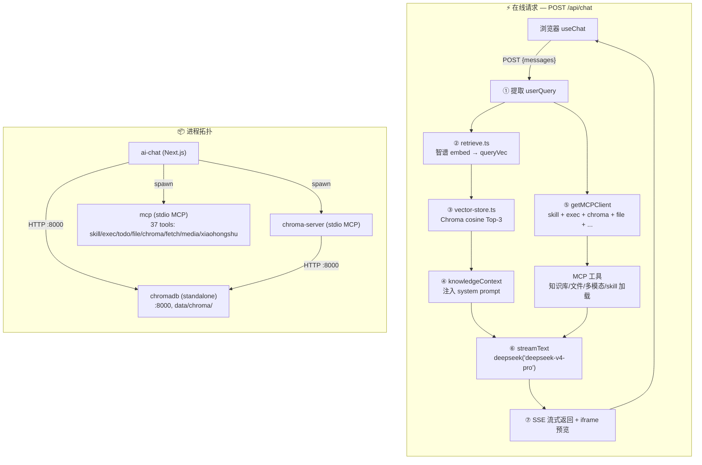

# 小盛开AI 设计文档

## UI 风格

**像素复古风** — 后续所有 UI 开发均遵循此风格，组件库使用 shadcn/ui。

### 视觉规范

| 元素 | 规范 |
|------|------|
| 背景 | 12px 点阵网格 + 全屏扫描线叠加层（CRT 效果） |
| 边框 | 3px 实线 + 8 方向 box-shadow 像素扩展 |
| 气泡 | 用户蓝色实心（`pixel-bubble`）、AI 灰色（`pixel-bubble-ai`） |
| 头像 | 2px 像素边框，AI/ME 标签 |
| 按钮 | 像素边框 + 按下位移 `translate(2px,2px)` |
| 输入框 | 终端风格，`>` 提示符，focus 时变蓝 |
| 字体 | `font-mono` 等宽像素感 |
| 加载 | 4 方块依次跳动动画 |
| 入场 | 消息淡入上移 `msg-enter` |

### 组件规则

- 基础组件用 shadcn/ui（Button、Input 等），不手写
- 像素风格样式通过 CSS class（`pixel-*`）叠加，不修改 shadcn 组件源码
- 所有像素样式定义在 `globals.css`，无额外依赖

## 架构流程



## 环境与外部依赖

### 运行时

| 依赖 | 要求 | 验证 |
|---|---|---|
| Node.js | ≥ 20 | `node --version` |
| Python | ≥ 3.10(仅 Chroma 需要) | `python3 --version` |
| uv | latest(安装 Chroma 用) | `uv --version` |

### 外部 API

| 服务 | URL | 用途 |
|---|---|---|
| 智谱 AI | `https://open.bigmodel.cn/api/paas/v4` | Embedding(`embedding-3`) |
| DeepSeek V4 Pro | `https://api.deepseek.com/v1` | 对话生成 |
| MiniMax | `https://api.minimaxi.com/v1` | 图片生成、图片理解、TTS/BGM |
| MiniMax-M3 | `https://api.minimaxi.com/v1/chat/completions` | 图片理解（OpenAI 兼容） |

### 本地依赖

| 路径 | 是否必须 | 用途 |
|---|---|---|
| `data/chroma/` | 运行时持久化 | Chroma 数据 |
| `packages/mcp/` | 必选 | MCP 服务器集合 |

## API 约定

### POST /api/chat

**请求体**
```json
{
  "messages": [
    {
      "id": "msg_1",
      "role": "user",
      "parts": [{ "type": "text", "text": "记住 Java Stream 是惰性求值" }]
    }
  ]
}
```

**响应** — SSE 流式返回，由 `@ai-sdk/react` 的 `useChat` 自动解析。

**处理流程**
1. 提取最后一条用户消息
2. 智谱 `embedding-3` 生成查询向量
3. Chroma cosine 检索 Top-3 知识片段
4. 注入 `knowledgeContext` + `SKILL_LIST` 到 system prompt
5. 启动/复用 1 个 MCP client（统一 mcp 入口，37 tools）
6. `streamText` 调用 DeepSeek V4 Pro，LLM 可自主调工具（含 loadSkill/exec）
7. SSE 流式返回，图表/视频通过 iframe 预览

## 环境变量

API Key 统一在项目根目录 `.env` 配置：

```bash
DEEPSEEK_API_KEY=sk-xxx
DEEPSEEK_BASE_URL=https://api.deepseek.com/v1
DEEPSEEK_PRO_MODEL=deepseek-v4-pro
DEEPSEEK_FLASH_MODEL=deepseek-v4-flash
GLM_API_KEY=xxx
GLM_BASE_URL=https://open.bigmodel.cn/api/paas/v4
GLM_EMBEDDING_MODEL=embedding-3
MINIMAX_API_KEY=xxx
MINIMAX_BASE_URL=https://api.minimaxi.com/v1
MINIMAX_IMAGE_MODEL=image-01
```

CHROMA_URL 和 CHROMA_AUTO_START 有默认值，无需配置。

## 图片生成经验

### OSS 签名 URL 规则

MiniMax 返回的图片链接包含三个绑定校验的参数：

| 参数 | 说明 |
|------|------|
| `Expires` | OSS 签名的过期时间（Unix 时间戳） |
| `OSSAccessKeyId` | 访问密钥 ID |
| `Signature` | 基于 Expires 等参数计算出的签名 |

**关键原则：URL 中任何一个字符都不能修改，必须原样透传。** 修改任意参数（如 Expires）会导致签名不匹配，OSS 返回 `SignatureDoesNotMatch`。

### 防护措施

- system prompt 已明确规则：URL 必须原样输出，不得修改
- `generateImage` 工具描述已强调"必须原样使用不得修改任何字符"
- 遇到 `SignatureDoesNotMatch` 错误，重新生成比尝试修复链接更高效

## 已知问题

| # | 问题 | 影响 | 解决方案 |
|---|---|---|---|
| 1 | Chroma Python 包需 `uv tool install` | 一次性配置 | 已在快速开始文档化 |
| 2 | Chroma v3 where 不支持 `$exists` | 软删改用 `deleted` 字段 + `$ne: true` | 已处理 |
| 3 | Chroma 启动需 Python 进程 | 多了 ~50MB 内存 | standalone server 比 embedded 更稳 |
| 4 | `next/font/google` 构建时下载字体被墙 | 国内构建超时 | 改用本地 `@fontsource` 字体，移除 `Geist` 导入 |
| 5 | `getOrCreateCollection` 误创建大量空 collection | 管理面板有大量垃圾表 | 已清理，后续 `getCollectionSafe` 不自动创建 |

## 知识库架构

### 多库多表

```
shared/  — 规则、偏好、个人信息
  └── base_knowledge

chat/    — 聊天产生的内容，按主题分 collection
  ├── chat_knowledge（默认）
  └── learn-<主题>（学习笔记，如 learn-finance）

code/    — 编码记忆，按项目名分 collection
  └── <项目名>（basename(process.cwd())）
```

## SKILL 系统

### 设计理念

```
Skills = 知识（What）   ← 静态 SKILL.md 文件，描述"怎么做得好"
MCP    = 执行（How）    ← 工具函数，执行具体操作
```

### 架构

```
用户提问
  → route.ts 启动时扫描 skills/ 目录，构建 SKILL_LIST
  → SKILL_LIST 注入 system prompt（<available_skills> 段）
  → AI 根据用户需求判断是否需要加载 skill
  → AI 调用 loadSkill({ name }) 获取完整 SKILL.md 内容
  → AI 按 SKILL 指引执行（如 exec 调用 generate-from-template.py）
```

### 目录

```
skills/
├── greet/                       # 问候技能
│   └── SKILL.md
├── image-styles/                # 图片风格库（73 种风格）
│   ├── SKILL.md
│   └── styles/
└── xiaohongshu-note/            # 小红书笔记
    └── SKILL.md
```
```

### RAG 预检索

`retrieve.ts` 动态获取 shared + chat 所有 collection，不做硬编码。新增 `listCollections(database)` 函数（60s 缓存），未来任何新 collection 自动纳入检索。

### 工具使用

- `addKnowledge`: 主题笔记 → `database="chat" collection="<命名>"`，一般对话 → `database="chat"`（不传 collection）
- `searchKnowledge`: 默认搜 shared + chat/chat_knowledge，传 database 和 collection 时搜 shared + 指定库表
- `searchKnowledge` 每个 collection 取 `topK * 3`，合并后截断，避免跨 collection 遗漏

## 生产部署

```bash
npm run prod   # 构建 + 后台启动（端口 4567）
npm run stop   # 停掉所有服务（:4567 + :8000）
npm run log    # 查看实时日志
```

- 服务地址：`http://localhost:4567`
- 日志文件：`/tmp/xiaosheng-ai.log`
- Chroma 后台运行在 `:8000`，dev/production 共用同一份数据

## 目录结构

```
ai-engineer-journey/
├── package.json                # npm workspaces 根配置
├── .env                        # 共享环境变量
├── .env.example
├── design.md
├── packages/
│   ├── ai-chat/                # 业务服务（Next.js）
│   │   ├── src/
│   │   │   ├── instrumentation.ts
│   │   │   ├── lib/
│   │   │   │   ├── providers.ts
│   │   │   │   ├── retrieve.ts
│   │   │   │   ├── vector-store.ts
│   │   │   │   └── chroma-server.ts
│   │   │   └── app/
│   │   │       ├── page.tsx
│   │   │       ├── api/chat/route.ts
│   │   │       ├── api/admin/chroma/route.ts
│   │   │       ├── api/note/[taskId]/status/route.ts
│   │   │       ├── note/[taskId]/page.tsx
│   │   │       └── preview/[taskId]/route.ts
│   │   ├── scripts/
│   │   ├── data/chroma/
│   │   └── package.json
│   └── mcp/             # MCP 工具服务
│       ├── package.json
│       ├── index.js             # 统一入口
│       ├── lib/env.js           # 统一 dotenv 加载
│       ├── lib/chroma.js        # 共享 Chroma 搜索
│       ├── lib/minimax.js       # 共享 MiniMax 图片生成
│       ├── templates/
│       │   ├── animation.html   # 动画骨架模板
│       │   ├── default.md       # Neo-Brutalist 风格描述
│       │   └── cream.md         # 奶油风格描述
│       └── tools/
│           ├── skill/index.js     # 1 tool（技能加载）
│           ├── exec/index.js      # 1 tool（Shell 执行）
│           ├── diagram/index.js   # 1 tool（图表生成）
│           ├── todo/index.js      # 6 tools
│           ├── file/index.js      # 10 tools
│           ├── chroma/index.js    # 5 tools
│           ├── fetch/index.js     # 2 tools
│           ├── xiaohongshu/      # 4 tools（小红书笔记）
│           │   ├── index.js
│           │   └── templates/
│           └── media/             # 7 tools
│               ├── image.js     # 图片生成
│               ├── video.js     # 视频/语音
│               ├── audio.js     # TTS/BGM
│               └── html-builder.js
│   └── skills/                  # 技能模块
│       └── greet/               # 问候技能
│           └── SKILL.md
```