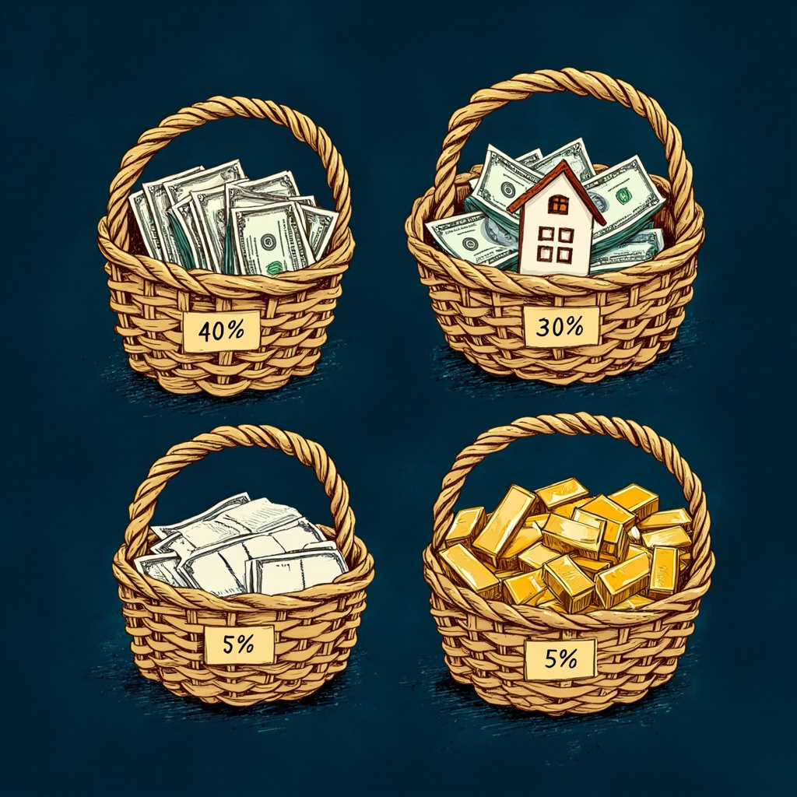

# 188万怎么分？4个篮子5维变量搞定
> 200万砸1只股，1天跌90%！3个反直觉真相教你不踩雷

`#资产配置`
`#分散化`
`#金融入门`
`#理财基础`
`#程序员理财`

### 老王的死循环

老王是我同行，2020年干了件让我想骂他的事——把200万全砸进某只教育股，理由是「双减不可能落地」。
2021年7月23日，文件下来，股价**一天跌90%**，200万变20万。
他第二天还想正常上班？我看是想 Ctrl+Alt+Del 重启人生。
**作为同行我的第一反应：这不就是写了个死循环还上生产吗？**
资产配置，就是给钱的 `try-catch`——**不保证不出错，但保证出错时程序不挂。**

### 分散化到底分什么？

很多人以为分散=买很多只股票。
**错。**
分散化消不掉「系统性风险」——大盘一起跌（2008、2022），谁也跑不掉。
分散化消的是「特定风险」——某家公司暴雷、某个行业被锤。
这俩区别啥意思？**系统性风险是地震来了，再好的房子也晃；特定风险是某根柱子烂了，换掉那根就行。**

### 真正的分散=凑齐5种「跷跷板资产」

- 📈 **股票**——跟经济走，涨时凶
- 🏠 **房产**——抗通胀，但变现慢到让你哭
- 💵 **现金/货币基金**——应急用，被通胀慢慢啃
- 🏅 **黄金**——乱世救命，跟股市常常反着走
- 📄 **债券**——稳定收息，跟股票跷跷板

> **关键是「不相关」**——涨时不一起涨，跌时不一起跌。

**买100只银行股 ≠ 分散**，它们同涨同跌，本质还是1只。

### Brinson 1986：90%的波动来自配置

学术研究老早就发现：

> **一个组合长期收益波动，90%取决于资产配置比例，不取决于具体买哪只。**

我们程序员最懂：

> **架构定生死，代码只是锦上添花。资产配置就是财务架构。**

具体到188万（开了100万房贷的版本），分4个篮子：

- 🏦 **安全垫 40%（75万）**：货币基金+国债+T+0，跑赢通胀底线
- 🏠 **保命仓 30%（56万）**：自住房+稳健储蓄型保险，对冲房贷
- 📈 **进攻仓 25%（47万）**：沪深300+中证500指数基金，长期跟国运
- 🏅 **保险仓 5%（10万）**：黄金ETF，黑天鹅救命

### 为什么是40/30/25/5？

配比不是死数，是5个变量算出来的：

- **年龄**——大→进攻↓
- **负债**——房贷高→安全垫↑（有100万房贷，安全垫必须40%）
- **现金流**——工资稳→进攻可↑
- **家庭责任系数**（新变量）——身后站几个人
- **风险偏好**——夜夜睡得着才好

**关键不是比例本身，是你背后的真实处境。**

> **房贷还清那天，比例就该从40/30/25/5变成25/30/40/5。**

### 3个反直觉真相

**① 分散不是数量游戏，是种类游戏**

买100只银行股，本质还是1只——同涨同跌。

**② 黄金防的不是人民币，是「所有法币失灵」**

- 🇿🇼 津巴布韦2008：1个面包 = 3亿津元
- 🇻🇪 委内瑞拉2018：货币贬值99.99%
- 🇹🇷 土耳其2021：里拉一年腰斩
- 🇩🇪 魏玛德国1923：1美元 = 4.2万亿马克

**配黄金 = 信不过任何主权货币时最后的底牌。**

**③ 配比不是按钱分，是按「身后的人」分**

单收入+4口人？安全垫从40%拉到60%。

> **你身后站着几个人，决定你能投多少钱。**

### 老王算账：173万 vs 20万

假设老王当年只拿30万买教育股，剩下170万分散到4个篮子：

- 教育股：30万 → 3万（亏27万）
- 分散篮子170万：基本不亏
- **总资产还剩 173万**

而不是一夜回到解放前的20万。

**173万 vs 20万 = 8.6倍的差距，这就是分散的威力。**

> **「分散不是让你多赚，是让你不死。」**

> **「配比不是按钱分，是按身后站着几个人分。」**

> **「你不是在管钱，你是在管一家公司的现金流。」**

放银行还是分4个篮子，不是喜好问题。
是**这一家子未来30年睡不睡得着**的问题。

