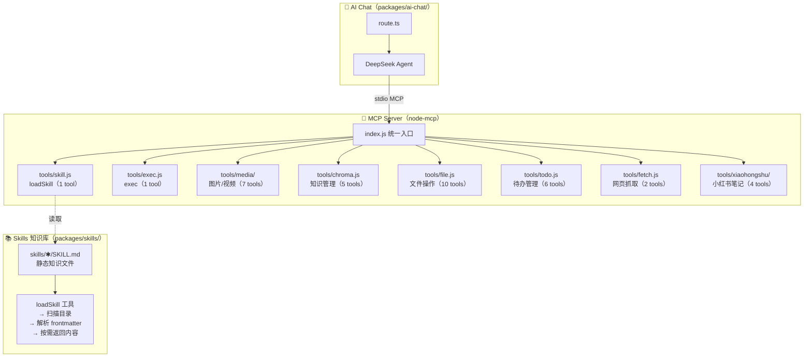

# mcp

统一 MCP 服务器，为 AI Chat 提供工具调用和 skill 知识加载能力。

## 架构



## 设计理念

```
MCP  = 执行（How）   ← 工具函数，执行具体操作（调 API、读写文件、查数据库）
Skill = 知识（What）  ← 静态文件，描述"怎么做得好"（规则、最佳实践、风格指南）

两者互补：Skill 提供背景知识，MCP 工具负责执行。
```

## 目录

```
mcp/
├── index.js              # 统一入口，注册所有工具
├── lib/
│   ├── env.js            # 统一 dotenv 加载
│   ├── chroma.js         # 共享 Chroma 搜索逻辑
│   └── minimax.js        # 共享 MiniMax 图片生成
├── tools/
│   ├── skill/index.js     # 技能加载（1 tool）
│   ├── exec/index.js      # Shell 命令执行（1 tool）
│   ├── diagram/index.js   # 图表生成（1 tool）
│   ├── todo/index.js      # 时间 + Todo（6 tools）
│   ├── file/index.js      # 文件系统操作（10 tools）
│   ├── chroma/index.js    # 知识库 CRUD（5 tools）
│   ├── fetch/index.js     # 网页爬取（2 tools）
│   ├── xiaohongshu/        # 小红书笔记（4 tools）
│   │   ├── index.js
│   │   └── templates/
│   │       ├── knowledge.md
│   │       └── knowledge/
│   │           └── finance.md
│   └── media/             # 多模态生成（7 tools）
│       ├── image.js      # 图片生成（2 tools）
│       ├── video.js      # 视频/语音（5 tools）
│       ├── audio.js      # TTS/BGM 工具函数
│       ├── html-builder.js # HTML 构建工具
│       └── utils.js
├── templates/
│   ├── animation.html    # 动画骨架模板
│   ├── default.md        # Neo-Brutalist 风格描述
│   └── cream.md          # 奶油风格描述
├── package.json
└── README.md
```

## 工具一览

### 技能加载（skill）

| 工具 | 说明 |
|------|------|
| `loadSkill` | 加载领域知识。不传 name 返回可用 skill 列表，传 name 加载完整内容 |
| `exec` | 执行 shell 命令。可在项目根或 skills/ 目录下运行脚本，默认超时 60s |

### 时间与待办（todo）

| 工具 | 说明 |
|------|------|
| `getCurrentTime` | 获取当前日期和时间 |
| `getTodoList` | 查询待办事项列表 |
| `addTodoItem` | 新增待办事项 |
| `editTodoItem` | 编辑待办事项 |
| `deleteTodoItem` | 删除待办事项 |
| `getTodoDetail` | 获取待办事项详情 |

### 文件系统（file）

| 工具 | 说明 |
|------|------|
| `readFile` | 读取文件内容 |
| `readDirectory` | 读取目录结构（支持递归深度） |
| `getFileInfo` | 获取文件元数据（大小/权限/时间） |
| `searchFiles` | 通配符搜索文件（如 *.java） |
| `writeFile` | 创建或覆盖文件 |
| `appendFile` | 追加内容到文件末尾 |
| `replaceInFile` | 查找并替换文本（首个匹配） |
| `createDirectory` | 创建目录（支持递归） |
| `deleteFile` | 删除文件（不可逆） |
| `moveFile` | 移动或重命名文件/目录 |

### 知识库（chroma）

| 工具 | 说明 |
|------|------|
| `addKnowledge` | 新增笔记（自动向量化存储） |
| `searchKnowledge` | 语义检索知识库 |
| `updateKnowledge` | 修订已有笔记 |
| `deleteKnowledge` | 软删除笔记（3 秒内可恢复） |
| `restoreKnowledgeById` | 撤销最近的软删除 |

### 多模态生成（media）

| 工具 | 状态 | 说明 |
|------|------|------|
| `generateImage` | ✅ | 根据文本描述生成图片 |
| `generateImageFromImage` | ✅ | 根据参考图和描述生成新图片 |
| `generateHTMLPreview` | ✅ | 生成 GSAP HTML 预览（不渲染），返回 taskId 后用 renderVideo 渲染 |
| `renderVideo` | ✅ | 将 HTML 预览渲染为 MP4 视频 |
| `checkTaskProgress` | ✅ | 查询动画预览和视频渲染任务进度 |
| `generateVideo` | 🔲 | 文生视频（暂未实现） |
| `generateSpeech` | 🔲 | 文生语音（暂未实现） |

### 图表生成（diagram）

| 工具 | 状态 | 说明 |
|------|------|------|
| `generateDiagram` | ✅ | 根据描述生成图表，Mermaid（流程图/时序图/ER图等）+ D2（架构图/拓扑图等）双引擎，3 套主题，4 层校验，失败自修复 |

**总计：37 个工具（35 已实现，2 预留）**

### 小红书笔记（xiaohongshu）

| 工具 | 状态 | 说明 |
|------|------|------|
| `generateXiaohongshuNote` | ✅ | 根据主题和模板生成笔记（含封面/插画/标签），自动检索记忆库，异步生成配图 |
| `updateXiaohongshuNote` | ✅ | 修改已生成的笔记（标题/摘要/正文/标签/替换图片） |
| `checkXiaohongshuNoteProgress` | ✅ | 查询笔记生成进度，轮询等图片就绪 |
| `exportXiaohongshuNote` | ✅ | 导出笔记为本地文件夹（HTML + MD + 图片下载） |

## 运行

```bash
node index.js
```

## 环境变量

在项目根目录 `.env` 统一配置：

```bash
DEEPSEEK_API_KEY=sk-xxx
DEEPSEEK_BASE_URL=https://api.deepseek.com/v1
DEEPSEEK_PRO_MODEL=deepseek-v4-pro
DEEPSEEK_FLASH_MODEL=deepseek-v4-flash
GLM_API_KEY=xxx
GLM_BASE_URL=https://open.bigmodel.cn/api/paas/v4
GLM_EMBEDDING_MODEL=embedding-3
MINIMAX_API_KEY=xxx
MINIMAX_BASE_URL=https://api.minimaxi.com/v1
MINIMAX_IMAGE_MODEL=image-01
```

| 模块 | 依赖的 Key |
|------|-----------|
| chroma | GLM_API_KEY, GLM_BASE_URL, GLM_EMBEDDING_MODEL |
| media | MINIMAX_API_KEY, MINIMAX_BASE_URL, MINIMAX_IMAGE_MODEL, DEEPSEEK_API_KEY, DEEPSEEK_BASE_URL, DEEPSEEK_FLASH_MODEL |
| xiaohongshu | DEEPSEEK_API_KEY, DEEPSEEK_BASE_URL, DEEPSEEK_PRO_MODEL, MINIMAX_API_KEY, MINIMAX_BASE_URL, MINIMAX_IMAGE_MODEL |
| diagram | DEEPSEEK_API_KEY, DEEPSEEK_BASE_URL, DEEPSEEK_FLASH_MODEL |

## 技术栈

- [Model Context Protocol (MCP)](https://modelcontextprotocol.io/)
- `@modelcontextprotocol/sdk` + `zod`
- stdio 传输（子进程 stdin/stdout）
- Node.js ESM