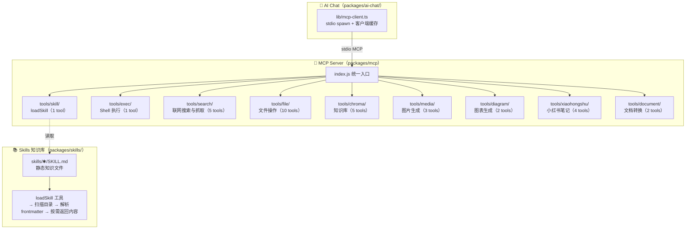

# mcp

统一 MCP 服务器（`@modelcontextprotocol/sdk`，stdio 传输），为 AI Chat 提供 33 个工具与 skill 知识加载能力。由 ai-chat 的 `lib/mcp-client.ts` spawn `node ../mcp/index.js` 拉起。

## 架构



## 设计理念

```
MCP   = 执行（How）   ← 工具函数，执行具体操作（调 API、读写文件、查数据库）
Skill = 知识（What）  ← 静态文件，描述"怎么做得好"（规则、最佳实践、风格指南）

两者互补：Skill 提供背景知识，MCP 工具负责执行。
```

## 目录

```
mcp/
├── index.js              # 统一入口，注册所有工具模块
├── lib/
│   ├── env.js            # 统一 dotenv 加载
│   ├── chroma.js         # 共享 Chroma 客户端（network.json + providers.json 配置）
│   └── task-state.js     # 异步任务状态（图片/图表等长任务）
├── tools/
│   ├── skill/index.js    # 技能加载（1 tool）
│   ├── exec/index.js     # Shell 命令执行（1 tool）
│   ├── search/index.js   # 联网搜索与抓取（5 tools，调 packages/services/search）
│   ├── file/index.js     # 文件系统操作（10 tools）
│   ├── chroma/index.js   # 知识库增删查（5 tools）
│   ├── media/index.js    # 图片生成（3 tools）
│   ├── diagram/          # 图表生成（2 tools）
│   │   ├── index.js
│   │   └── templates/
│   ├── xiaohongshu/      # 小红书笔记（4 tools）
│   │   ├── index.js
│   │   └── templates/
│   ├── document/index.js # 文档转换（2 tools，依赖 pandoc）
│   └── todo/index.js     # 待办管理（6 tools，暂未注册）
├── examples/default.md
├── package.json
└── README.md
```

## 工具一览（33 个已注册）

### 技能与执行（skill / exec）

| 工具 | 说明 |
|------|------|
| `loadSkill` | 加载领域知识。不传 name 返回可用 skill 列表，传 name 加载完整内容 |
| `exec` | 执行 shell 命令。可在项目根或 skills/ 目录下运行脚本，默认超时 60s |

### 联网搜索与抓取（search）

| 工具 | 说明 |
|------|------|
| `searchWeb` | 联网搜索（本地 SearXNG，分类 general/images/videos/news/wechat） |
| `scrapeWebPage` | 抓指定 URL 正文为 Markdown（Firecrawl Cloud） |
| `mapWebsite` | 发现网站内所有 URL（Firecrawl Cloud /map） |
| `crawlWebsite` | 抓网站多页正文（Firecrawl Cloud /crawl，最多 20 页） |
| `parseDocument` | 解析在线 PDF 为 Markdown（Firecrawl Cloud） |

### 文件系统（file）

| 工具 | 说明 |
|------|------|
| `readFile` | 读取文件内容 |
| `readDirectory` | 读取目录结构（支持递归深度） |
| `getFileInfo` | 获取文件元数据（大小/权限/时间） |
| `searchFiles` | 通配符搜索文件（如 *.java） |
| `writeFile` | 创建或覆盖文件 |
| `appendFile` | 追加内容到文件末尾 |
| `replaceInFile` | 查找并替换文本（首个匹配） |
| `createDirectory` | 创建目录（支持递归） |
| `deleteFile` | 删除文件（不可逆） |
| `moveFile` | 移动或重命名文件/目录 |

### 知识库（chroma）

| 工具 | 说明 |
|------|------|
| `addKnowledge` | 新增笔记（自动向量化存储） |
| `searchKnowledge` | 语义检索知识库 |
| `updateKnowledge` | 修订已有笔记 |
| `deleteKnowledge` | 软删除笔记（3 秒内可恢复） |
| `restoreKnowledgeById` | 撤销最近的软删除 |

### 图片生成（media）

| 工具 | 说明 |
|------|------|
| `generateImage` | 根据文本描述生成图片（异步，返回 taskId） |
| `generateImageFromImage` | 根据参考图和描述生成新图片 |
| `checkImageProgress` | 查询图片生成任务进度 |

### 图表生成（diagram）

| 工具 | 说明 |
|------|------|
| `generateDiagram` | 根据描述生成图表，Mermaid + D2 双引擎，失败自修复重试 |
| `checkDiagramProgress` | 查询图表生成任务进度 |

### 小红书笔记（xiaohongshu）

金融知识笔记先生成传播角度与标题/封面候选，再按最佳候选生成正文；图片任务以 `ready`、`partial`、`failed` 为终态，`partial` 返回失败图片明细并支持单图重试。

| 工具 | 说明 |
|------|------|
| `generateXiaohongshuNote` | 根据主题和模板生成笔记（含封面/插画/标签），自动检索记忆库，异步生成配图 |
| `updateXiaohongshuNote` | 修改已生成的笔记（标题/摘要/正文/标签/替换图片） |
| `checkXiaohongshuNoteProgress` | 查询笔记生成进度，轮询等图片就绪 |
| `exportXiaohongshuNote` | 导出笔记为本地文件夹（HTML + MD + 图片下载） |

### 文档转换（document）

| 工具 | 说明 |
|------|------|
| `convertDocument` | Markdown / HTML / 纯文本 → PDF 或 Word |
| `convertDocumentBatch` | 批量转换目录下的 Markdown |

> `tools/todo/`（6 tools：getCurrentTime + 待办 CRUD）代码存在但未在 index.js 注册。

## 运行

```bash
node index.js   # 一般不手动跑，由 ai-chat 按需 spawn
```

## 配置

- **模型 / API Key**：`data/settings/providers.json` 为真源（每次调用 fresh-read，改配置无需重启），`.env` 只作默认值兜底；读取逻辑在 `@app/shared/llm/config.js`
- **端口 / host**：`config/network.json`，经 `@app/shared/network.js` 的 `loadNetworkConfig()` 读取
- **外部依赖**：document 工具需要系统安装 `pandoc`

## 技术栈

- [Model Context Protocol (MCP)](https://modelcontextprotocol.io/)
- `@modelcontextprotocol/sdk` + `zod`
- stdio 传输（子进程 stdin/stdout）
