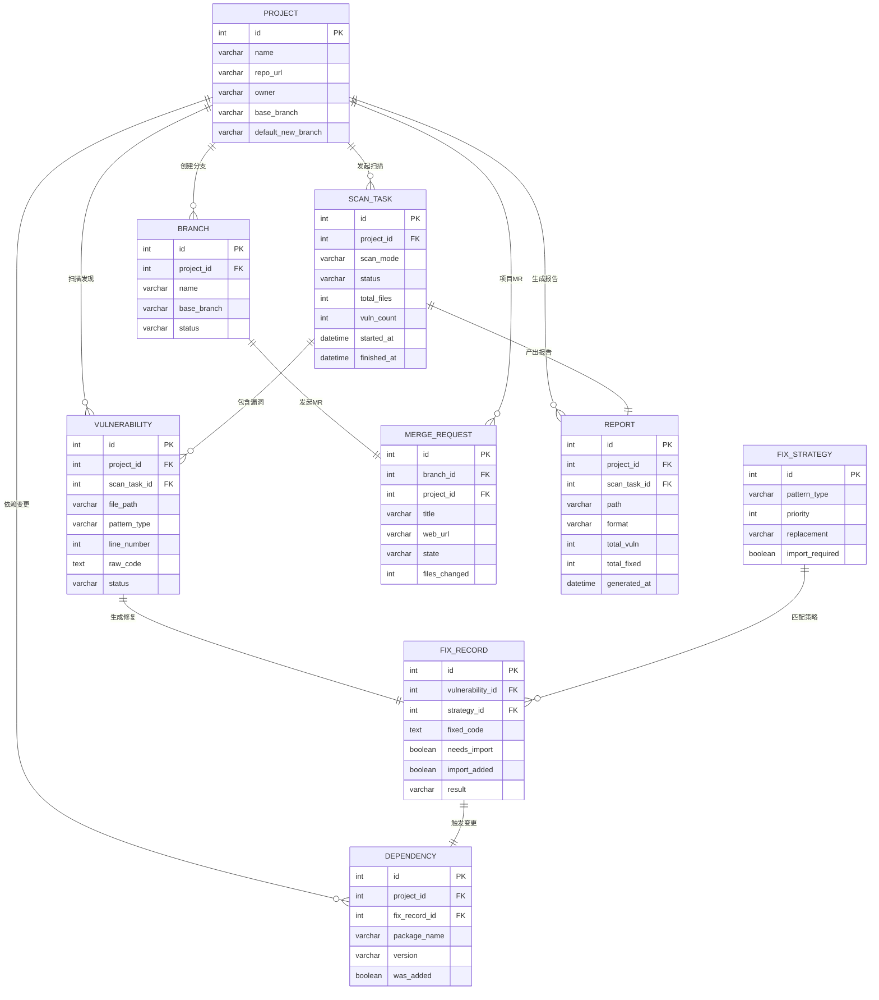

# Mermaid ER 图示例

### 关系语法

| 符号 | 含义 |
|---|---|
| `||--o{` | 一对零或多 |
| `}|--||` | 一或多对一 |
| `||--||` | 一对一 |
| `}o--o{` | 零或多对零或多 |

### 通用规则

- 实体名用英文大写，属性名 snake_case
- 属性格式: `类型 属性名 KEY`（类型: int varchar text boolean datetime）
- 约束: PK(主键) FK(外键) UK(唯一)
- 关系线用双引号标注含义
- 实体间用 `--` 实线连接