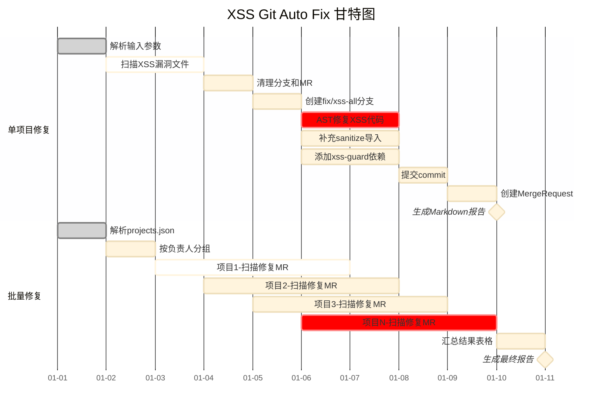

# Mermaid 甘特图示例

### 配色规则

| 状态 | 色值 | 说明 |
|---|---|---|
| done | `#C5E0C5` 浅绿 | 已完成任务 |
| active | `#B5D8EB` 浅蓝 | 进行中任务 |
| crit | `#D4A5F5` 浅紫 | 关键路径 |
| milestone | `#FFD700` 金色 | 里程碑节点 |

### 通用规则

- 马卡龙柔和色系，避免高饱和度
- 任务名用空格对齐，不用 tab
- section 分组按功能划分
- milestone 持续天数为 0d