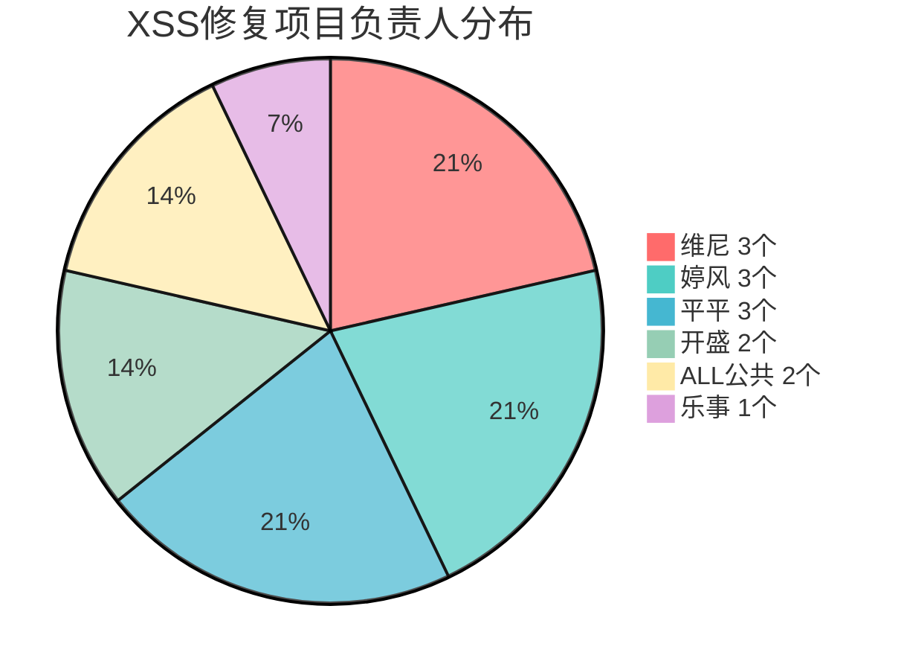

# Mermaid 饼图示例

### 配色规则

| 扇区 | 色值 | 说明 |
|---|---|---|
| pie1 | `#FF6B6B` 红 | 第一扇区，醒目 |
| pie2 | `#4ECDC4` 青 | 高对比度 |
| pie3 | `#45B7D1` 蓝 | 与青色区分 |
| pie4 | `#96CEB4` 绿 | 柔和过渡 |
| pie5 | `#FFEAA7` 黄 | 亮色收尾 |
| pie6 | `#DDA0DD` 紫 | 最后补充 |

### 通用规则

- 标签格式: `"名称 数值"` 再 `: 数值`，方便阅读
- 配色用 `%%{init: ...}%%` 全局配置
- 相邻扇区色差明显，避免相似色
- 数值为整数