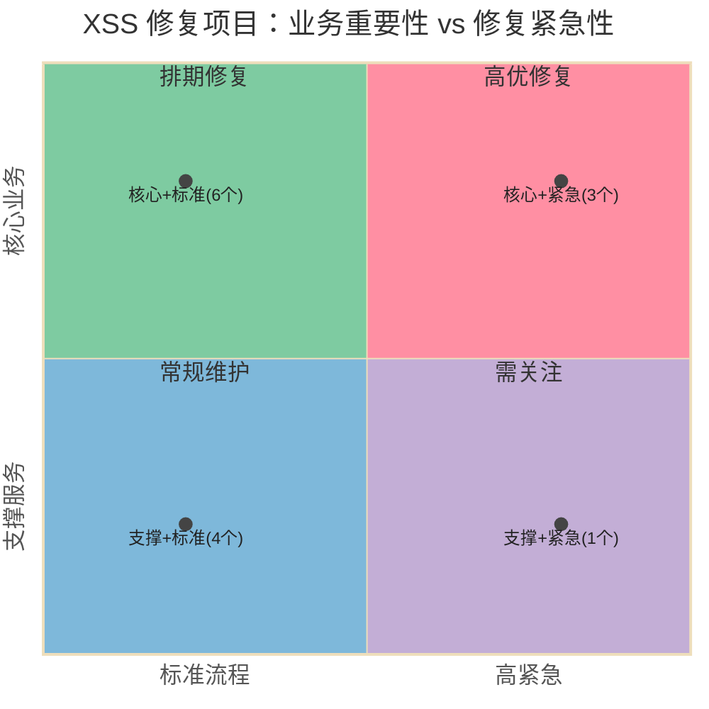

# Mermaid 象限图示例

### 配色规则

| 元素 | 色值 | 说明 |
|---|---|---|
| quadrant-1（右上） | `#FF8FA3` 粉 | 高优修复 |
| quadrant-2（右下） | `#7ECBA1` 绿 | 排期修复 |
| quadrant-3（左上） | `#7EB8DA` 蓝 | 常规维护 |
| quadrant-4（左下） | `#C3AED6` 紫 | 需关注 |
| 数据点 | `#444444` 深灰 | 点颜色 |
| 文字 | `#333333` / `#555555` | 标题/坐标轴 |

### 通用规则

- 14 个 `themeVariables` 精细控制颜色
- 数据点标签带数量标注，如 `"核心+紧急(3个)"`
- x和y值在0-1之间
- 坐标轴标签描述维度含义
- 象限名用行动指向（"高优修复"/"排期修复"）