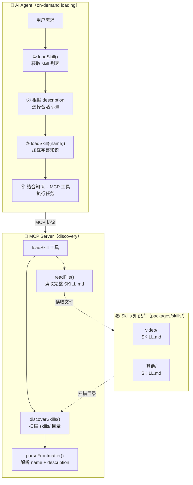

# Skills

可复用领域知识模块，对标 opencode/codex 的 SKILL 机制。每个 skill 是一个独立的 `SKILL.md` 文件，包含该领域的专业知识（规则、最佳实践、风格指南等）。

## 设计理念

```
Skills = 知识（What）       ← 静态文件，描述"怎么做得好"
MCP    = 执行（How）        ← 工具函数，执行具体操作

两者互补：Skill 提供背景知识，MCP 工具负责执行。
```

## 架构



## SKILL.md 格式

每个 skill 目录下必须有一个 `SKILL.md`，以 YAML frontmatter 开头：

```markdown
---
name: video
description: 生成高质量视频内容
---

# 图表生成规则

## 形状词汇表
...
```

### Frontmatter 字段

| 字段 | 必填 | 说明 |
|------|------|------|
| `name` | ✅ | skill 名称，必须与目录名一致 |
| `description` | ✅ | 简短描述（≤1024 字符），AI 据此判断是否加载 |

## 加载流程

1. **用户提问** → AI 分析需求，判断是否需要专业领域知识
2. **无参调用** → `loadSkill()` 获取所有可用 skill 及其描述
3. **选择加载** → `loadSkill({ name: "xxx" })` 加载完整内容
4. **注入上下文** → skill 内容作为背景知识，指导 AI 执行后续操作

## Token 控制

- **清单开销**：skill 列表只有 name + description，约 50 tokens/skill
- **按需加载**：完整内容只在 AI 判断需要时才加载
- **按需生效**：非相关场景零开销

## 如何新增 Skill

```
1. 在 skills/ 下新建目录: skills/<skill-name>/
2. 创建 SKILL.md，包含 frontmatter（name + description）
3. 编写领域知识内容
4. 重启 MCP server，AI 下次调用 loadSkill() 即可发现
```

无需修改任何代码。
